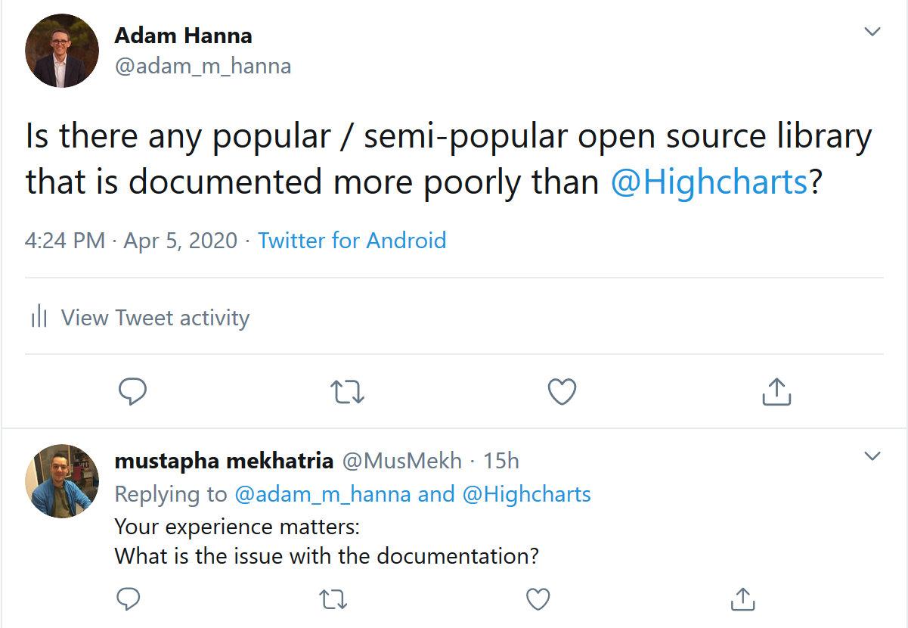

# Typescript Highcharts

This is an example repo showing that typescript in Hicharts@^8.0.0 is broken, or at the very least, doesn't follow the most recent demo's.

This is in reply to my [tweet](https://twitter.com/adam_m_hanna/status/1246941906975756289)



## Apology

First, let me apologize to the people at Highcharts for my mean spirited tweet. I was in a grumpy mood and threw a temper tantrum. I'm not excusing my actions simply offering an explanation.

I am sorry. Thank you for taking the high road.

Furthermore, there may very well be a mistake on my end causing that's these problems. It wouldn't be the first time...

## Demo

This repo attempts to recreate [this demo](https://jsfiddle.net/gh/get/library/pure/highcharts/highcharts/tree/master/samples/stock/demo/basic-line/).

## Errors

I receive two errors in this project. When working with my own projects, these types of errors are numerous and frustrating.

### Error #1

The first, line 12 of [src/App.tsx](src/App.tsx): 

```typescript
const tmpData = Highcharts.getJSON('https://www.highcharts.com/samples/data/aapl-c.json');
```

The error that I receive is `Property 'getJSON' does not exist on type 'typeof import ${__dirname}/typescript-highcharts/node_modules/highcharts/highcharts`.

I also receive the same error when attempting the import `import Highcharts from 'highcharts';` as opposed (apposed?) to `import Highcharts from 'highcharts/highstock';`.

### Error #2

The second error that I receive is on line 24 of [src/App](src/App.tsx).

```typescript
Highcharts.stockChart('container', {
```

The error that I receive is `No overload matches this call. ...`

I get this same error with the other import as well.


From reading the [relevant section of your docs](https://api.highcharts.com/highcharts/chart.renderTo), I gather that the correct initialization may look something like:

```typescript
Highcharts.stockChart({
	chart: {
		renderTo: 'container',
	}

	...
});
```

But this was not easy to find in your docs, and I actually only solved this issue by googling and stackoverflow.

## Documentation

In general, I find your [documentation](https://api.highcharts.com/highcharts/) difficult to naviate, unintuitive and overall a non-pleasant experience. I also don't like how no examples are given in the documentation itself for the various methods. Yes, I know that you have plenty on your [demo page](https://www.highcharts.com/stock/demo/), but I'm not talking about full-fledged, end-to-end examples. Rather, just little snippets explaining the methods, etc.

As an example, I love the various [golang pkg docs](https://golang.org/pkg/crypto/).
